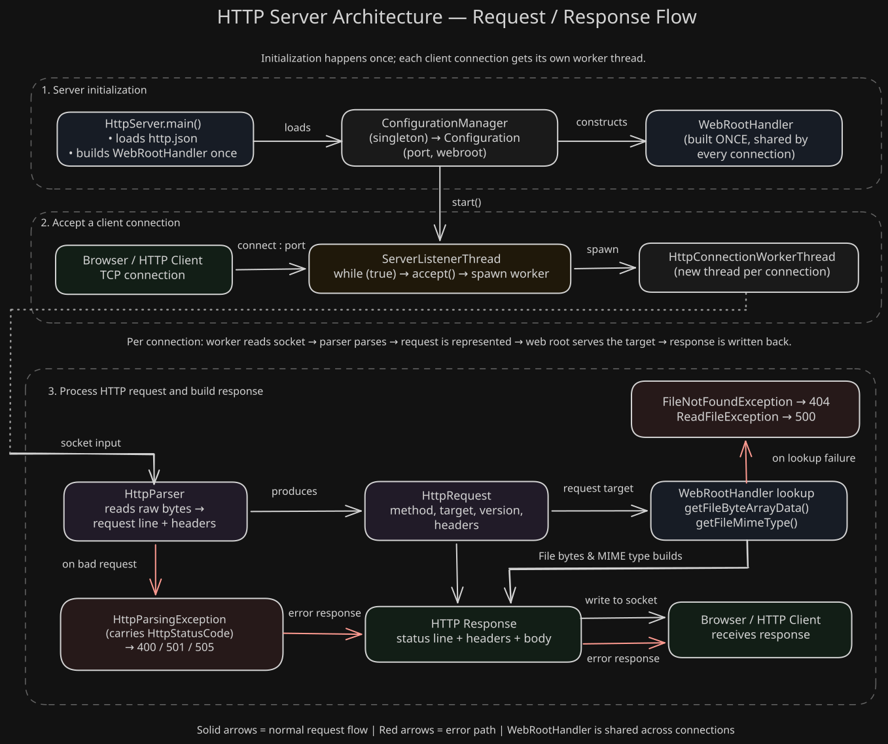

# http-server-java

A multithreaded HTTP/1.1 server built from raw Java sockets. Parses real HTTP requests byte-by-byte, serves static files from a configurable web root, and returns correct HTTP status codes on failure.

Built as a learning project to understand what web frameworks actually do under the hood before using one.

## Features

- Raw `ServerSocket`/`Socket`-based networking — no HTTP library
- Byte-level request parser (`HttpParser`) that reads the request line and headers character-by-character, correctly handling `CR`/`LF`
- One worker thread per connection, so one client can't block another
- Static file serving with correct MIME types, resolved from a configurable web root
- Path-traversal protection — requests can't escape the web root directory
- JSON-based configuration (`http.json`) for port and web root, loaded via Jackson
- Proper HTTP status codes on failure (400, 404, 500, 501, 505) instead of always responding 200
- JUnit test coverage for the parser, header parsing, HTTP version resolution, and web root handling

## Requirements

- Java 21
- Maven

## Running it

1. Clone the repo and open it in your IDE (or run via Maven on the command line).
2. Run `HttpServer.main()`.
    - The server loads `src/main/resources/http.json` using a path relative to the project root — run it from the project root (IntelliJ does this by default) or the config file won't be found.
3. Check the console for `Using port: ...` and `Using webRoot: ...` to confirm it started.
4. Open `http://localhost:<port>` in a browser (default port is in `http.json`).

### Configuration

Edit `src/main/resources/http.json`:

```json
{
  "port": 8080,
  "webroot": "webRoot"
}
```

Files placed in the `webroot` directory (e.g. `webRoot/index.html`) are served directly — `/` maps to `index.html`, `/logo.png` maps to `webRoot/logo.png`, and so on.

## Architecture



- **`com.adesidaleye.http`** — protocol-level types: `HttpRequest`, `HttpMethod`, `HttpVersion`, `HttpStatusCode`, and `HttpParser` (the actual parsing logic).
- **`com.adesidaleye.httpserver.core`** — the networking layer: accepting connections and handling each one on its own thread.
- **`com.adesidaleye.httpserver.core.io`** — `WebRootHandler`, which safely resolves a request path to a file on disk.
- **`com.adesidaleye.httpserver.config`** — loads and exposes `http.json` as a `Configuration` object via a singleton `ConfigurationManager`.

## Known limitations

- No `Connection: keep-alive` support — every request opens a new TCP connection, even for multiple requests from the same browser tab.
- No thread pool — a new thread is spawned per connection with no upper bound, so it isn't hardened against high connection volume.
- Only `GET`/`HEAD` are modeled in `HttpMethod`; other methods (`POST`, etc.) aren't handled.

## Possible future improvements

- `Connection: keep-alive` support, so one TCP connection can serve multiple requests
- A bounded thread pool instead of unlimited per-connection threads
- Basic request logging in a standard access-log format
- `POST` support with a request body
